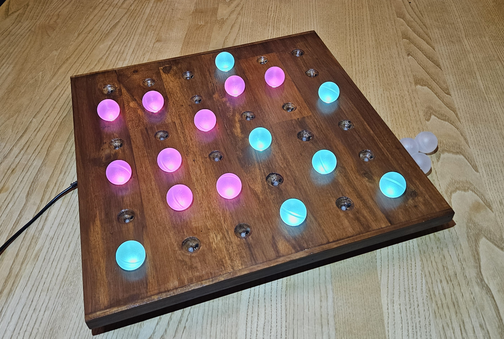

Maker Media GmbH

***

# Licht-Memo-Spiel

**Statt Karten umzudrehen und sich Bilderpaare zu merken, erscheinen bei diesem Spiel unterschiedliche Lichtmuster, wenn man lichtdurchlässige Kugeln auf das Spielbrett legt. Wer die meisten Paare gefunden hat, gewinnt. Das Spiel kann man selber bauen und es hat durchaus einen gewissen Suchtfaktor.Vorspann aus dem Heft**

Hier gibt es den Code für das Spiel im Verzeichnis _src_. Der Stand des Codes entspricht dem Artikel in der gedruckten Make-Ausgabe und bei heise+. Auf der [Projektseite des Autors](https://surasto.de/index.php?cat=Elektronik&page=LED-Memory) gibt es ggf. neuere Versionen [des Codes zum Download](https://surasto.de/index.php?cat=Elektronik&file=LEDMemory-Deo-Memory.zip).

Der vollständige Artikel zum Projekt steht in der **[Make-Ausgabe 2/24 ab Seite z](https://www.heise.de/select/make/xxx)**.